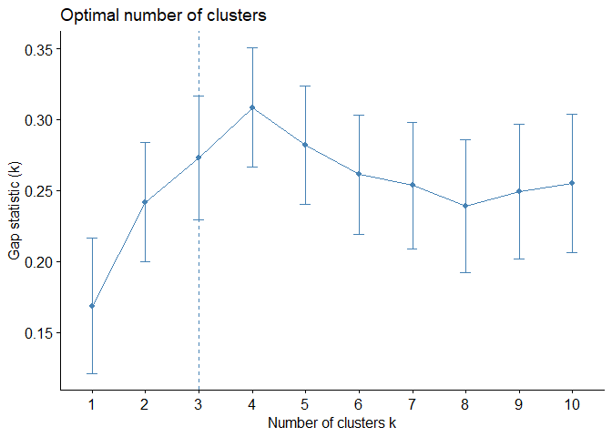

Assignment 4
================
Chee Kay Cheong (cc4778)
2023-02-08

``` r
knitr::opts_chunk$set(message = FALSE, warning = FALSE)

library(tidyverse)
library(ggbiplot)
library(stats)
library(factoextra)
library(cluster)
library(caret)
library(modelr)

set.seed(123)
```

Note: You must turn in an R-Markdown word document with your code and
generated output clearly labeled. Make sure all answers to specific
questions are clearly labeled. Do not just turn in unannotated output.
This assignment builds upon group work from class. You can consult with
fellow students on strategies, but the document you turn in must be your
own, individual work. Group members cannot turn in the same R-markdown
word document.

REMEMBER TO SET YOUR SEED USING 123 TO ENSURE REPRODUCIBLE RESULTS.

# Part I: Implementing a Simple Prediction Pipeline

The New York City Department of Health administered a questionnaire on
general health and physical activity among residents. Using the dataset
`class4_p1.csv`, fit and evaluate two prediction models using linear
regression. The aim of the models are to predict the number of days in a
month an individual reported having good physical health (feature name:
healthydays). A codebook is provided so you can look-up the meaning and
values of each feature in the dataset. (Note the codebook lists
information on features that are not included in your dataset).

### Step 1: Load and clean dataset

``` r
class4 = read_csv("./Data/class4_p1.csv") %>% 
  janitor::clean_names() %>% 
  select(-x1) %>% 
  mutate(
    chronic1 = as_factor(chronic1),
    chronic3 = as_factor(chronic3),
    chronic4 = as_factor(chronic4),
    tobacco1 = as_factor(tobacco1),
    alcohol1 = as_factor(alcohol1),
    habits5 = as_factor(habits5),
    habits7 = as_factor(habits7),
    agegroup = as_factor(agegroup),
    dem3 = as_factor(dem3),
    dem4 = as_factor(dem4),
    dem8 = as_factor(dem8),
    povertygroup = as_factor(povertygroup)) %>% 
  drop_na()
```

### Step 2: Partition data into training and testing (use a 70/30 split)

``` r
train.index = createDataPartition(class4$healthydays, p = 0.7, list = FALSE)

class4_train = class4[train.index, ]
class4_test = class4[-train.index, ]
```

Fit two prediction models using different subsets of the features in the
training data. Features can overlap in the two models, but the feature
sets should not be exactly the same across models. Clearly state which
features were used in the two models.

``` r
model_1 = lm(healthydays ~ chronic4 + gpaq8totmin + gpaq11days + habits5 + habits7 + agegroup, data = class4_train)
summary(model_1)
```

    ## 
    ## Call:
    ## lm(formula = healthydays ~ chronic4 + gpaq8totmin + gpaq11days + 
    ##     habits5 + habits7 + agegroup, data = class4_train)
    ## 
    ## Residuals:
    ##      Min       1Q   Median       3Q      Max 
    ## -29.9364  -0.3118   1.6832   3.5408  15.1613 
    ## 
    ## Coefficients:
    ##              Estimate Std. Error t value Pr(>|t|)    
    ## (Intercept) 26.987116   1.217104  22.173  < 2e-16 ***
    ## chronic42    3.585501   0.779387   4.600 4.57e-06 ***
    ## gpaq8totmin -0.001968   0.002040  -0.964 0.334992    
    ## gpaq11days   0.108306   0.072731   1.489 0.136659    
    ## habits52     0.044100   0.444385   0.099 0.920962    
    ## habits53    -1.867959   0.584294  -3.197 0.001417 ** 
    ## habits54    -3.848199   0.976720  -3.940 8.52e-05 ***
    ## habits72    -0.385106   0.630110  -0.611 0.541176    
    ## habits73    -1.336052   0.612274  -2.182 0.029254 *  
    ## habits74    -3.547256   0.701825  -5.054 4.84e-07 ***
    ## habits75    -6.040697   1.033448  -5.845 6.18e-09 ***
    ## agegroup2   -0.900919   0.753784  -1.195 0.232197    
    ## agegroup3   -2.584410   0.738916  -3.498 0.000483 ***
    ## agegroup4   -4.341033   0.778890  -5.573 2.95e-08 ***
    ## ---
    ## Signif. codes:  0 '***' 0.001 '**' 0.01 '*' 0.05 '.' 0.1 ' ' 1
    ## 
    ## Residual standard error: 7.268 on 1523 degrees of freedom
    ## Multiple R-squared:  0.1278, Adjusted R-squared:  0.1204 
    ## F-statistic: 17.17 on 13 and 1523 DF,  p-value: < 2.2e-16

``` r
model_2 = lm(healthydays ~ bmi + tobacco1 + alcohol1 + habits5 + habits7, data = class4_train)
summary(model_2)
```

    ## 
    ## Call:
    ## lm(formula = healthydays ~ bmi + tobacco1 + alcohol1 + habits5 + 
    ##     habits7, data = class4_train)
    ## 
    ## Residuals:
    ##      Min       1Q   Median       3Q      Max 
    ## -29.2591   0.1698   2.0902   3.2301  12.8006 
    ## 
    ## Coefficients:
    ##             Estimate Std. Error t value Pr(>|t|)    
    ## (Intercept) 30.70507    1.46593  20.946  < 2e-16 ***
    ## bmi         -0.02109    0.02996  -0.704   0.4816    
    ## tobacco12   -0.89503    1.06466  -0.841   0.4007    
    ## tobacco13    0.27000    0.63055   0.428   0.6686    
    ## alcohol12   -1.24884    1.13686  -1.099   0.2722    
    ## alcohol13   -2.47696    1.10491  -2.242   0.0251 *  
    ## habits52    -0.03642    0.45472  -0.080   0.9362    
    ## habits53    -2.35710    0.59480  -3.963 7.75e-05 ***
    ## habits54    -5.04178    0.98532  -5.117 3.50e-07 ***
    ## habits72    -0.10206    0.64275  -0.159   0.8739    
    ## habits73    -1.04508    0.62539  -1.671   0.0949 .  
    ## habits74    -3.04183    0.71474  -4.256 2.21e-05 ***
    ## habits75    -5.19390    1.06398  -4.882 1.16e-06 ***
    ## ---
    ## Signif. codes:  0 '***' 0.001 '**' 0.01 '*' 0.05 '.' 0.1 ' ' 1
    ## 
    ## Residual standard error: 7.426 on 1524 degrees of freedom
    ## Multiple R-squared:  0.0888, Adjusted R-squared:  0.08163 
    ## F-statistic: 12.38 on 12 and 1524 DF,  p-value: < 2.2e-16

Apply both models within the test data and determine which model is the
preferred prediction model using the appropriate evaluation metric(s).
Describe one setting (in 1-2 sentences) where the implementation of your
final model would be useful.

``` r
rmse(model_1, class4_test)
```

    ## [1] 7.218366

``` r
rmse(model_2, class4_test)
```

    ## [1] 7.401421

# Part II: Conducting an Unsupervised Analysis

Using the dataset from the Group assignment Part 3 (USArrests), identify
clusters using hierarchical analysis. Use an agglomerative algorithm for
hierarchical clustering. Use a Euclidian distance measure to construct
your dissimilarity matrix.

### Step 1: Load dataset & prepare for analysis

``` r
data("USArrests")
# Checked no missing data.

# Check means and SDs to determine if scaling is necessary
colMeans(USArrests, na.rm = TRUE)
```

    ##   Murder  Assault UrbanPop     Rape 
    ##    7.788  170.760   65.540   21.232

``` r
apply(USArrests, 2, sd, na.rm = TRUE)
```

    ##    Murder   Assault  UrbanPop      Rape 
    ##  4.355510 83.337661 14.474763  9.366385

Means and standard deviations are very different from each other. Center
and scaling are needed.

``` r
US_Arrests = scale(USArrests)
```

Conduct a hierarchical clustering analysis. Be sure to specify the
linkage method used. Within your analysis, make sure you do both of the
following:

``` r
# Create Dissimilarity matrix
diss.matrix = dist(US_Arrests, method = "euclidean")

# Hierarchical clustering using Complete Linkage
clusters.h = hclust(diss.matrix, method = "complete" )

# Plot the obtained dendrogram
plot(clusters.h, cex = 0.6, hang = -1)
```

<!-- -->
Determine the optimal number of clusters using a clear, data-driven
strategy.

``` r
gap_stat = clusGap(US_Arrests, FUN = hcut, K.max = 10, B = 50)
fviz_gap_stat(gap_stat)
```

<!-- -->

Describe the composition of each cluster in terms of the original input
features

``` r
clusters = kmeans(US_Arrests, 3, nstart = 25)
```

Pretend that the data are from 2020 and not 1973. Describe one research
question that can be addressed using the newly identified clusters.
Briefly comment on any scientific or ethical considerations one should
review before using these clusters for your specific question. NOTE: The
clusters can be used as an exposure, an outcome or a covariate.
