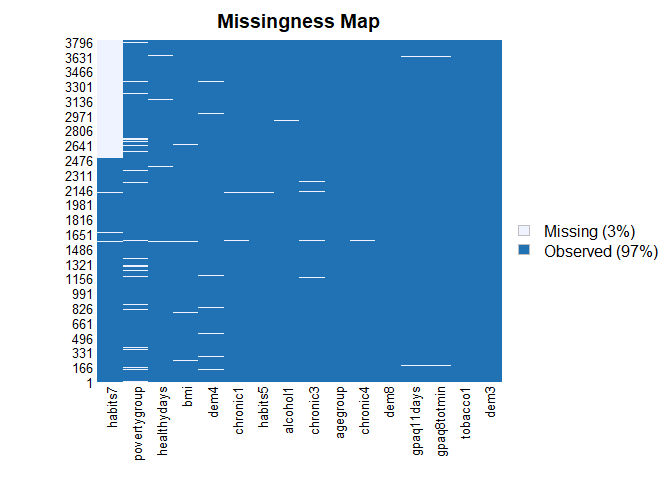
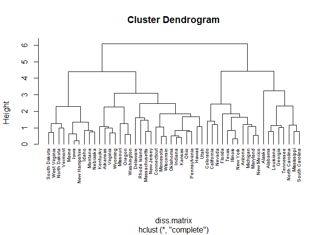
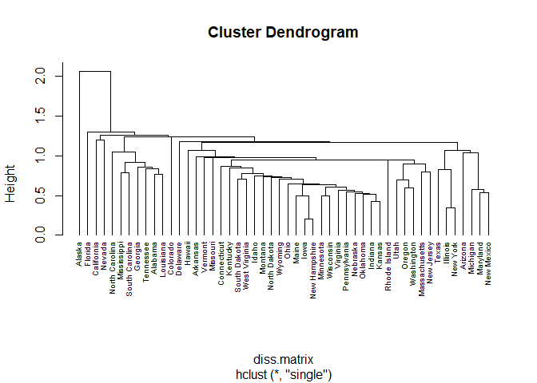
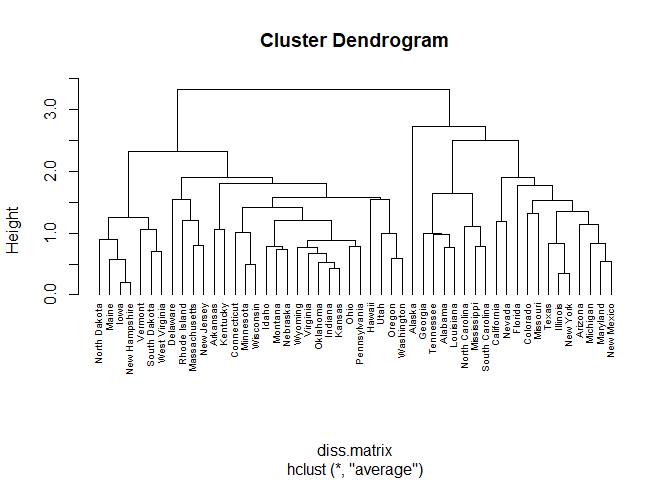
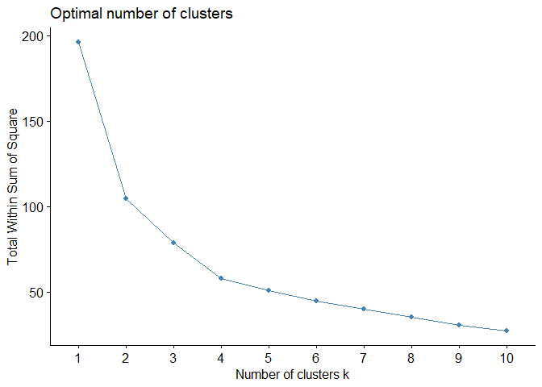
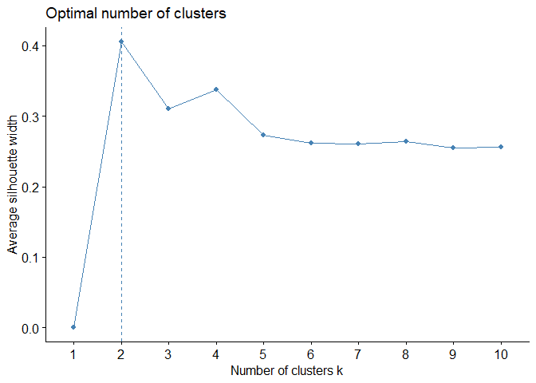
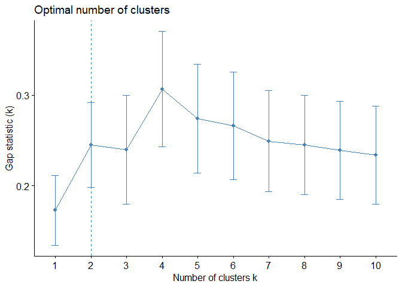
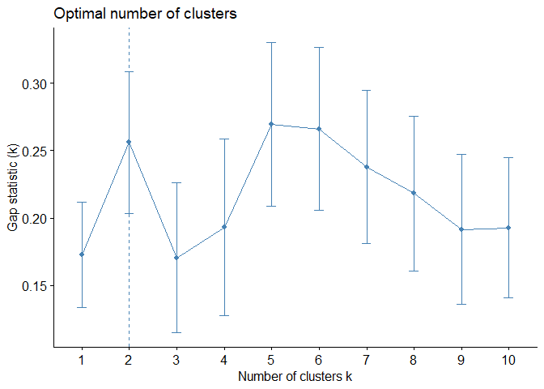
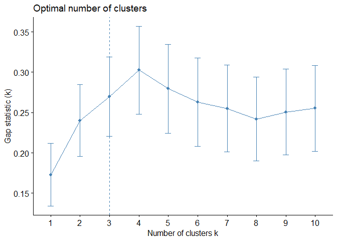

Assignment 4
================
Chee Kay Cheong (cc4778)
2023-02-08

``` r
knitr::opts_chunk$set(message = FALSE, warning = FALSE)

library(tidyverse)
library(stats)
library(factoextra) # make graphs for clustering 
library(cluster) # clustering analysis
library(caret)
library(modelr)
library(Amelia) # Can be used to examine missing data using `missmap()`
library(Metrics)

set.seed(123)
```

# Part I: Implementing a Simple Prediction Pipeline

The New York City Department of Health administered a questionnaire on
general health and physical activity among residents. Using the dataset
`class4_p1.csv`, fit and evaluate two prediction models using linear
regression. The aim of the models are to predict the number of days in a
month an individual reported having good physical health (feature name:
`healthydays`).

### Step 1: Load and clean dataset

``` r
class4 = read_csv("./Data/class4_p1.csv") %>% 
  janitor::clean_names() %>% 
  select(-x1) %>% 
  mutate(
    chronic1 = as_factor(chronic1),
    chronic3 = as_factor(chronic3),
    chronic4 = as_factor(chronic4),
    tobacco1 = as_factor(tobacco1),
    alcohol1 = as_factor(alcohol1),
    habits5 = as_factor(habits5),
    habits7 = as_factor(habits7),
    agegroup = as_factor(agegroup),
    dem3 = as_factor(dem3),
    dem4 = as_factor(dem4),
    dem8 = as_factor(dem8),
    povertygroup = as_factor(povertygroup))

# Check variable names and types
str(class4)
```

    ## tibble [3,811 × 16] (S3: tbl_df/tbl/data.frame)
    ##  $ chronic1    : Factor w/ 2 levels "1","2": 2 2 1 2 2 1 1 1 1 2 ...
    ##  $ chronic3    : Factor w/ 2 levels "1","2": 2 2 1 2 2 1 1 1 1 2 ...
    ##  $ chronic4    : Factor w/ 2 levels "1","2": 2 2 2 1 2 2 2 2 2 2 ...
    ##  $ bmi         : num [1:3811] 26.8 28.2 39.2 42.5 22.3 ...
    ##  $ tobacco1    : Factor w/ 3 levels "1","2","3": 3 3 1 3 3 3 3 3 3 2 ...
    ##  $ alcohol1    : Factor w/ 3 levels "1","2","3": 3 3 2 3 NA 2 2 3 2 2 ...
    ##  $ gpaq8totmin : num [1:3811] 0 120 60 180 0 0 0 0 15 0 ...
    ##  $ gpaq11days  : num [1:3811] 5 5 3 5 7 7 7 5 5 7 ...
    ##  $ habits5     : Factor w/ 4 levels "1","2","3","4": 3 1 1 2 2 3 2 3 4 2 ...
    ##  $ habits7     : Factor w/ 5 levels "1","2","3","4",..: NA NA NA NA NA NA NA NA NA NA ...
    ##  $ agegroup    : Factor w/ 4 levels "1","2","3","4": 1 3 3 2 2 3 3 4 3 2 ...
    ##  $ dem3        : Factor w/ 2 levels "1","2": 2 2 1 2 2 1 1 1 2 1 ...
    ##  $ dem4        : Factor w/ 2 levels "1","2": 1 2 1 1 2 2 1 1 1 1 ...
    ##  $ dem8        : Factor w/ 2 levels "1","2": 2 2 1 2 2 1 2 2 1 1 ...
    ##  $ povertygroup: Factor w/ 6 levels "1","2","3","4",..: 1 3 6 2 6 3 4 6 3 1 ...
    ##  $ healthydays : num [1:3811] 24 30 NA 23 30 30 30 10 0 30 ...

``` r
# Examine missing data
missmap(class4)
```

<!-- -->

``` r
# It seems like `habits7` has a lot of missing data, so we will remove this variable from our analysis.

# Limit our data to complete-case analysis
class4 = class4 %>% 
  select(-habits7) %>% 
  drop_na()
```

### Step 2: Partition data into training and testing (use a 70/30 split)

``` r
set.seed(123)

train.index = createDataPartition(class4$healthydays, p = 0.7, list = FALSE)

class4_train = class4[train.index, ]
class4_test = class4[-train.index, ]
```

## Problem 1

Fit two prediction models using different subsets of the features in the
training data.

- **Model 1**
  - Outcome: healthydays
  - Predictors: chronic4, gpaq8totmin, gpaq11days, habits5 & agegroup
- **Model 2**
  - Outcome: healthydays
  - Predictors: bmi, tobacco1, alcohol1, habits5

``` r
model_1 = lm(healthydays ~ chronic4 + gpaq8totmin + gpaq11days + habits5 + agegroup, data = class4_train)
summary(model_1) # Look at the model
```

    ## 
    ## Call:
    ## lm(formula = healthydays ~ chronic4 + gpaq8totmin + gpaq11days + 
    ##     habits5 + agegroup, data = class4_train)
    ## 
    ## Residuals:
    ##      Min       1Q   Median       3Q      Max 
    ## -29.6808   0.2262   2.2678   3.4599  14.9875 
    ## 
    ## Coefficients:
    ##               Estimate Std. Error t value Pr(>|t|)    
    ## (Intercept) 23.7956026  0.9223038  25.800  < 2e-16 ***
    ## chronic42    5.1155607  0.6620369   7.727 1.62e-14 ***
    ## gpaq8totmin -0.0001923  0.0017335  -0.111  0.91166    
    ## gpaq11days   0.1725178  0.0598633   2.882  0.00399 ** 
    ## habits52    -0.4034122  0.3551431  -1.136  0.25611    
    ## habits53    -2.9108191  0.4701304  -6.192 7.02e-10 ***
    ## habits54    -6.8109230  0.7836210  -8.692  < 2e-16 ***
    ## agegroup2   -1.1090186  0.6190408  -1.792  0.07334 .  
    ## agegroup3   -2.4858970  0.6065181  -4.099 4.30e-05 ***
    ## agegroup4   -3.1559411  0.6439072  -4.901 1.02e-06 ***
    ## ---
    ## Signif. codes:  0 '***' 0.001 '**' 0.01 '*' 0.05 '.' 0.1 ' ' 1
    ## 
    ## Residual standard error: 7.469 on 2332 degrees of freedom
    ## Multiple R-squared:  0.1041, Adjusted R-squared:  0.1006 
    ## F-statistic:  30.1 on 9 and 2332 DF,  p-value: < 2.2e-16

``` r
model_2 = lm(healthydays ~ bmi + tobacco1 + alcohol1 + habits5, data = class4_train)
summary(model_2)
```

    ## 
    ## Call:
    ## lm(formula = healthydays ~ bmi + tobacco1 + alcohol1 + habits5, 
    ##     data = class4_train)
    ## 
    ## Residuals:
    ##      Min       1Q   Median       3Q      Max 
    ## -29.0612   0.6849   2.5226   3.3398  12.4275 
    ## 
    ## Coefficients:
    ##             Estimate Std. Error t value Pr(>|t|)    
    ## (Intercept) 29.30450    1.17756  24.886  < 2e-16 ***
    ## bmi         -0.07919    0.02564  -3.089  0.00203 ** 
    ## tobacco12    0.62195    0.81982   0.759  0.44814    
    ## tobacco13    1.56223    0.51370   3.041  0.00238 ** 
    ## alcohol12   -0.15980    0.94557  -0.169  0.86581    
    ## alcohol13   -1.60115    0.92293  -1.735  0.08290 .  
    ## habits52    -0.36877    0.36163  -1.020  0.30795    
    ## habits53    -3.13548    0.47706  -6.573 6.08e-11 ***
    ## habits54    -7.45333    0.78912  -9.445  < 2e-16 ***
    ## ---
    ## Signif. codes:  0 '***' 0.001 '**' 0.01 '*' 0.05 '.' 0.1 ' ' 1
    ## 
    ## Residual standard error: 7.583 on 2333 degrees of freedom
    ## Multiple R-squared:  0.07613,    Adjusted R-squared:  0.07296 
    ## F-statistic: 24.03 on 8 and 2333 DF,  p-value: < 2.2e-16

## Problem 2

Apply both models within the test data and determine which model is the
preferred prediction model using the appropriate evaluation metric(s).

We will be using **Root Mean Square Error (RMSE)** as the appropriate
evaluation metric to compare how well the model is predicting against
the actual values.

``` r
rmse(model_1, class4_test)
rmse(model_2, class4_test)
```

Based on the result, it appears that *Model 1* is a better model in
predicting the number of days in a month an individual reported having
good physical health because it has a lower RMSE value compared to Model
2.

## Professor’s solution

Evaluate prediction model using *Mean Squared Error* and *Simple
Scatterplot*.

``` r
# Evaluate Model 1 in test set
fit_1 = predict(model_1, class4_test, type = 'response')

# Compare predicted and observed outcomes to get RMSE and R-squared using `postResample` in `Caret`
postResample(fit_1, class4_test$healthydays)
```

    ##       RMSE   Rsquared        MAE 
    ## 7.37794736 0.07027228 4.79419804

``` r
# Evaluate Model 2 in test set
fit_2 = predict(model_2, class4_test, type = 'response')

# Compare predicted and observed outcomes to get RMSE and R-squared using `postResample` in `Caret`
postResample(fit_2, class4_test$healthydays)
```

    ##       RMSE   Rsquared        MAE 
    ## 7.48485874 0.04434194 4.91427046

## Problem 3

In current state, both models are not very useful because they don’t
describe a lot of variance in the outcome, and they both have large
amount of errors.

One setting where the implementation of *Model 1* would be useful is
when we hope to predict a person’s overall perceived health in a senior
community.

# Part II: Conducting an Unsupervised Analysis

Using the dataset from the Group assignment Part 3 (USArrests), identify
clusters using hierarchical analysis. Use an agglomerative algorithm for
hierarchical clustering. Use a Euclidian distance measure to construct
your dissimilarity matrix.

### Step 1: Load dataset & prepare for analysis

``` r
data("USArrests")
# Checked no missing data.

# Check means and SDs to determine if scaling is necessary:
colMeans(USArrests, na.rm = TRUE)
```

    ##   Murder  Assault UrbanPop     Rape 
    ##    7.788  170.760   65.540   21.232

``` r
apply(USArrests, 2, sd, na.rm = TRUE)
```

    ##    Murder   Assault  UrbanPop      Rape 
    ##  4.355510 83.337661 14.474763  9.366385

``` r
# Means and standard deviations are very different from each other. Scaling is needed.
US_Arrests = scale(USArrests)
```

## Problem 4

We will be conducting a hierarchical clustering analysis using the
***complete*** linkage.

``` r
set.seed(123)

# Create Dissimilarity matrix
diss.matrix = dist(US_Arrests, method = "euclidean")

# Hierarchical clustering using Complete Linkage
clusters.h = hclust(diss.matrix, method = "complete" )

# Plot the obtained dendrogram
plot(clusters.h, cex = 0.6, hang = -1)
```

<!-- -->

### Professor’s note: Different linkage options

We can do Hierarchical clustering using different linkage options:  
\* Complete \~ can be sensitive to outliers as it is dependent upon
distance between farthest point within the clusters. Typically creates
nice spherical clusters.  
\* Single \~ can result in “chaining” clusters, due to focus only on
closest points between clusters. Can lead to chain of points extended
for long distances without consideration of overall shape of the
cluster.

- Average \~ less affected by outliers, prevents chaining that can occur
  in ‘Single’.

``` r
# Complete 
hc1 = hclust(diss.matrix, method = "complete")

# Single 
hc2 = hclust(diss.matrix, method = "single")

# Average
hc3 = hclust(diss.matrix, method = "average")
```

Plot each dendrogram

``` r
plot(hc1, cex = 0.6, hang = -1)
```

<!-- -->

``` r
plot(hc2, cex = 0.6, hang = -1)
```

<!-- -->

``` r
plot(hc3, cex = 0.6, hang = -1)
```

<!-- -->

### Professor’s note: Different methods to obtain optimal number of clusters

There are different ways to determine the optimal number of clusters: \*
Elbow Plot \~ Not the best method because it is not clear what linkage
methods was used. We need to match the linkage methods we used to create
the dendrogram.

``` r
# use the `fviz_nbclust` function but must put in scaled dataset, not the dissimilarity matrix.
fviz_nbclust(US_Arrests, FUN = hcut, method = "wss")
```

<!-- -->

``` r
fviz_nbclust(US_Arrests, FUN = hcut, method = "silhouette")
```

<!-- -->

- Gap Statistic

``` r
mydist = function(x) dist(x, method = "euclidean")

# Complete
mycluster_c = function(x, k) list(cluster = cutree(hclust(mydist(x), method = "complete"), k = k))
gap_stat_c = clusGap(US_Arrests, FUN = mycluster_c, K.max = 10, B = 50)
fviz_gap_stat(gap_stat_c)
```

<!-- -->

``` r
# Average
mycluster_a = function(x, k) list(cluster = cutree(hclust(mydist(x), method = "average"), k = k))
gap_stat_a = clusGap(US_Arrests, FUN = mycluster_a, K.max = 10, B = 50)
fviz_gap_stat(gap_stat_a)
```

<!-- -->

``` r
# Single: do the same, just change method to "single"
```

The “Complete” linkage methods identified 4 clusters as optimal. If we
look at the plot, we can see that it picks 2 as the optimal number but
it actually peaks at 4. Meaning 4 clusters will make the clusters as
homogeneous as possible.

For “Average” linkage, again it picks 2 as local optimal number of
clusters, but we can see from the plot that 5 is the optimal number.

Next, go back to the original dendrogram and cut it at 4 using `cutree`
function, and then aggregate the groups and give us the mean of each
groups.

``` r
groups_c = cutree(hc1, 4)
aggregate(US_Arrests, list(groups_c), mean)
```

    ##   Group.1     Murder    Assault   UrbanPop       Rape
    ## 1       1  1.4463290  0.9838289 -0.8317925  0.3529110
    ## 2       2  0.7499801  1.1199128  0.9361748  1.2156432
    ## 3       3 -0.4400338 -0.4353831  0.3607592 -0.2830385
    ## 4       4 -1.0579703 -1.1046626 -1.1219527 -1.0251554

Interpretation: Any values above 0 means they are above average; below 0
means below average.

#### a) Determine the optimal number of clusters using ***gap-statistic*** analysis.

``` r
gap_stat = clusGap(US_Arrests, FUN = hcut, K.max = 10, B = 50)
fviz_gap_stat(gap_stat)
```

<!-- -->

Based on the result, the optimal number of clusters is *3*.

#### b) Describe the composition of each cluster in terms of the original input features

``` r
clusters = kmeans(US_Arrests, 3, nstart = 25)

clusters
```

    ## K-means clustering with 3 clusters of sizes 20, 13, 17
    ## 
    ## Cluster means:
    ##       Murder    Assault   UrbanPop       Rape
    ## 1  1.0049340  1.0138274  0.1975853  0.8469650
    ## 2 -0.9615407 -1.1066010 -0.9301069 -0.9667633
    ## 3 -0.4469795 -0.3465138  0.4788049 -0.2571398
    ## 
    ## Clustering vector:
    ##        Alabama         Alaska        Arizona       Arkansas     California 
    ##              1              1              1              3              1 
    ##       Colorado    Connecticut       Delaware        Florida        Georgia 
    ##              1              3              3              1              1 
    ##         Hawaii          Idaho       Illinois        Indiana           Iowa 
    ##              3              2              1              3              2 
    ##         Kansas       Kentucky      Louisiana          Maine       Maryland 
    ##              3              2              1              2              1 
    ##  Massachusetts       Michigan      Minnesota    Mississippi       Missouri 
    ##              3              1              2              1              1 
    ##        Montana       Nebraska         Nevada  New Hampshire     New Jersey 
    ##              2              2              1              2              3 
    ##     New Mexico       New York North Carolina   North Dakota           Ohio 
    ##              1              1              1              2              3 
    ##       Oklahoma         Oregon   Pennsylvania   Rhode Island South Carolina 
    ##              3              3              3              3              1 
    ##   South Dakota      Tennessee          Texas           Utah        Vermont 
    ##              2              1              1              3              2 
    ##       Virginia     Washington  West Virginia      Wisconsin        Wyoming 
    ##              3              3              2              2              3 
    ## 
    ## Within cluster sum of squares by cluster:
    ## [1] 46.74796 11.95246 19.62285
    ##  (between_SS / total_SS =  60.0 %)
    ## 
    ## Available components:
    ## 
    ## [1] "cluster"      "centers"      "totss"        "withinss"     "tot.withinss"
    ## [6] "betweenss"    "size"         "iter"         "ifault"

*Cluster 1* has a medium urban population size, but they have the
greatest rate in murder, assault, and rape because all the values for
each features are positive (\>0) and are the highest among all three
clusters. *Cluster 2* has the smallest proportion of urban population,
as well as the lowest crime rate because all the values for each
features are negative (\<0) and are the smallest among all three
clusters. *Cluster 3* has the biggest urban population. Its crime rate
(murder, assault, rape) is not the lowest but still lower than average.

## Problem 5

One research question that can be addressed using the newly identified
clusters is: What are some contributing elements to the high crime rate
in the Cluster 1 states?

Before using these clusters for the above research question, we should
be careful for not including the state name in the cluster to avoid
defaming certain states.

#### Professor’s note

Does the violence profiles of a state predict greater incidence of
adverse birth outcomes?

Do states with similar violence profiles have similar criminal justice
policies at the state-level?

Do gun-owners have greater feelings of individual safety, controlling
for the violence profile of the state of residence?
